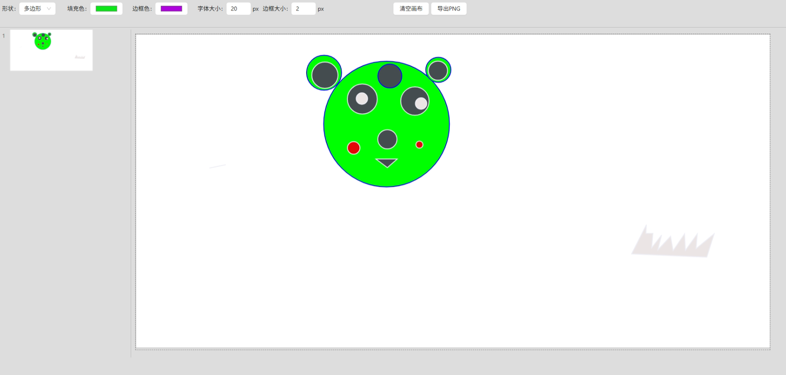

# FlyerDraw

#### 介绍
在这里可以自由画你的世界

#### 软件架构
软件架构说明

#### 安装教程

#### 使用说明

1.  访问地址
    * https://flyerhome.github.io/flyer-draw/

2. 截图样例
    

3. 操作绘图
   * 画圆和画矩形直接鼠标拖拽即可
   * 画矩形支持 shift长按 画正方形
   * 画多边形鼠标点一次定位一个顶点，最后可以使用 Enter 结束画图 鼠标最后存在的位置为最后一个顶点
   * 画多边形最后可以使用 esc 也可以 结束画图，鼠标最后存在的位置不会作为最后一个顶点

4. 开发思路
   * 画圆
     * 鼠标点下(mousedown) 确定起点xy 作为圆心
     * 拖拽鼠标(mousemove) 计算半径r
     * 鼠标放下(mouseup)结束绘制
     * 如果半径小于5 则撤销当前圆形
   * 画矩形
     * 鼠标点下(mousedown) 确定起点xy 作为左上角位置
     * 拖拽鼠标(mousemove) 计算宽高 width height
     * 鼠标放下(mouseup)结束绘制
     * 如果宽高都小于5 则撤销当前矩形
   * 画多边形
     * 点击第一下(mousedown+mouseup) 绘制一个顶点 作为多边形的起点 points[0]
     * 移动鼠标(mousemove) 寻找下一个顶点
     * 鼠标点击(mousedown+mouseup) 确定下一个顶点
     * 键盘按(keyup)Enter 鼠标所在位置为最后一个顶点
     * 键盘按(keyup)Esc 上一次鼠标点击的位置作为最后一个顶点
     * 如果顶点个数不超过2个，则撤销当前多边形
   * 新建文本框
     * 鼠标点击

#### 参与贡献

1.  Fork 本仓库
2.  新建 Feat_xxx 分支
3.  提交代码
4.  新建 Pull Request
