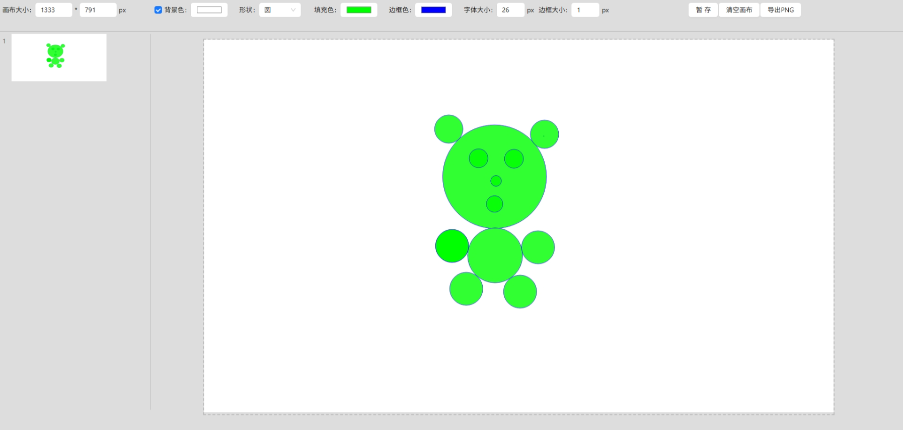

# FlyerDraw

#### 介绍
在这里可以自由画你的世界

#### 软件架构
软件架构说明

#### 安装教程

#### 使用说明

1.  访问地址
    * https://flyerhome.github.io/flyer-draw/

2. 截图样例
    

3. 操作绘图
   * 画圆和画矩形直接鼠标拖拽即可
   * 画矩形支持 shift长按 画正方形
   * 画多边形鼠标点一次定位一个顶点，最后可以使用 Enter 结束画图 鼠标最后存在的位置为最后一个顶点
   * 画多边形最后可以使用 esc 也可以 结束画图，鼠标最后存在的位置不会作为最后一个顶点
   * 新建文本
   * 画直线 两次点击 确定两个顶点

#### 参与贡献

1.  Fork 本仓库
2.  新建 Feat_xxx 分支
3.  提交代码
4.  新建 Pull Request
