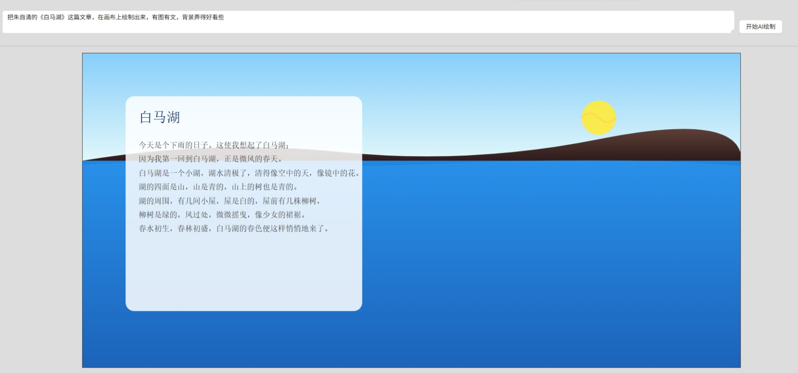
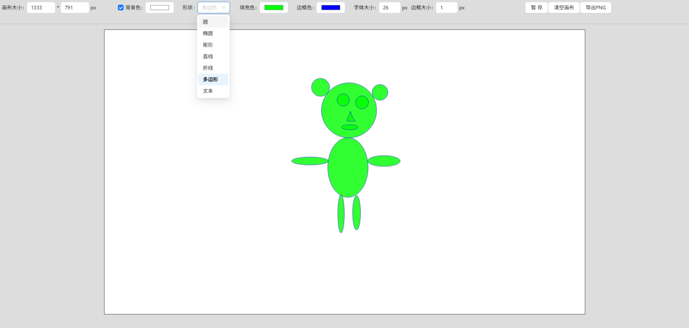

# FlyerDraw

#### 介绍
1. 绘画自由，在这里你就是一个绘画天才；
2. 这里支持手绘；
   * https://flyerhome.github.io/flyer-draw/#/
3. 更支持通过AI绘画
   * https://flyerhome.github.io/flyer-draw/#/ai

#### 软件架构
1. 前端架构
   * Vite 7.3+
   * Vue 3.5+
   * Ant-design-vue 4.2+
   * Vue-Router 4.6+
   * Axios 1.13+

2. 后端架构
   * 待定

3. AI智能体
   * 阿里云百炼

#### 安装教程
1. 前端本地运行
```
cd ./draw-ui
npm install
npm run dev
```

3. 前端服务器部署
   * 将draw-ui/deploy目录下的所有文件就是编译过后打包的静态资源，可以直接nginx部署

3. 后端部署
   后端暂时还没有开发内容

#### 使用说明

1. AI绘制版本
   * 访问地址
     * https://flyerhome.github.io/flyer-draw/#/ai
   * 图例
     
   * 操作
     * 配置AI智能体
       * 在阿里云百炼创建你的AI智能体
       * 提示词
         * 你是一个画家，也是一个作家，更是一个SVG绘图专家。你的回答内容只负责给出HTML绘图脚本，其他内容都不需要，连svg标签也不需要返回，比如 <rect x=20 y=20 width=20 height=20 /> ，每一个图形标签代码均要符合HTML编码规范
       * 得到你的Api地址
         * https://dashscope.aliyuncs.com/api/v1/apps/${appId}/completion
       * 获取你的应用IDappId,并填入你的Api地址中
       * 创建并获取你的ApiKey
       * 在页面上方填入你修改好的Api地址和ApiKey
       * 在文本框填好你要绘制的内容，然后点击开始AI绘制按钮
       * 等待一会儿时间，AI就帮你画好你想要的画面
2. 手绘版本
   * 访问地址
     * https://flyerhome.github.io/flyer-draw/#/
   * 图例
     
   * 操作
     * 绘图
       * 画圆
         * 左击鼠标（不要松开），确定圆心位置
         * 拖拽鼠标，调整圆的半径
         * 放开鼠标，确定圆的半径
         * 结束绘制
       * 画椭圆
         * 左击鼠标（松开鼠标），确定椭圆的圆心
         * 拖拽鼠标，调整椭圆的水平半径和垂直半径
         * 左击鼠标（松开鼠标），确定椭圆的水平半径和垂直半径
         * 结束绘制
       * 画矩形
         * 左击鼠标（不要松开），确定起点位置（左上角顶点）
         * 拖拽鼠标，调整矩形的宽高
         * 放开鼠标，确定矩形的宽高
         * 结束绘制
       * 画多边形
         * 左击鼠标（松开鼠标），确定第一个顶点
         * 左击鼠标（松开鼠标），确定第二个顶点
         * 左击鼠标（松开鼠标），确定第N个顶点
         * 键盘按esc或enter,结束绘制
       * 画直线
           * 左击鼠标（松开鼠标），确定第一个顶点
           * 左击鼠标（松开鼠标），确定第二个顶点
           * 结束绘制
       * 画折线
           * 左击鼠标（松开鼠标），确定第一个顶点
           * 左击鼠标（松开鼠标），确定第二个顶点
           * 左击鼠标（松开鼠标），确定第N个顶点
           * 键盘按esc或enter,结束绘制
       * 新建文本框
         * 左击鼠标（松开鼠标），确定文本框的位置
         * 输入文本内容
         * 键盘按esc或enter,结束文本编辑
     * 移动
       * 鼠标移动到图形上方
       * 左击鼠标（不要松开）
       * 拖拽鼠标，图形随鼠标移动
       * 松开鼠标
       * 结束移动
     * 编辑属性
       * 鼠标移动到图形上方
       * 左击鼠标（松开鼠标）
       * 右侧出现属性编辑侧边栏
       * 编辑图形的位置、填充色、边框色、边框大小、顶点等

#### 参与贡献

1.  Fork 本仓库
2.  新建 feature_xxx 分支
3.  提交代码
4.  新建 Pull Request
